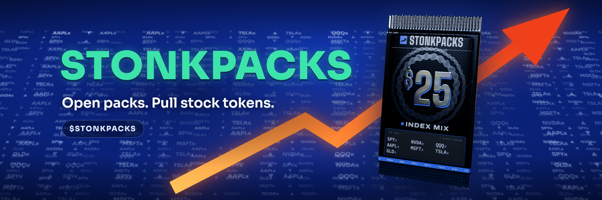

<p align="center">
  
</p>

# STONKPACKS

**Open packs. Pull real stocks.**

$25 packs of tokenized stocks on Solana. Each pack reveals one xStock, drawn by onchain VRF and delivered to your wallet. Keep it or sell it back at market.

**[stonkpacks.xyz](https://stonkpacks.xyz)** · **[Slides](https://slides.stonkpacks.xyz)**

## How it works

1. **Rip** a $25 pack with USDC.
2. **Draw.** A verifiable random function on Solana picks your pull. Public odds: 75 / 20 / 4 / 1.
3. **Reveal.** One xStock lands in your wallet, with its multiplier and PnL: stonks or not stonks.
4. **Keep or sell back** instantly at market.

## Stack

React · TypeScript · Vite · three.js · Privy · Solana

This repo is the web app. The API, custody and pack engine are separate and not included.

## Run it

```sh
pnpm install
pnpm dev   # http://127.0.0.1:5173
```

Build, env vars and layout: [DEVELOPMENT.md](DEVELOPMENT.md).

## License

All rights reserved. See [LICENSE](LICENSE) and [THIRD_PARTY_NOTICES.md](THIRD_PARTY_NOTICES.md).
